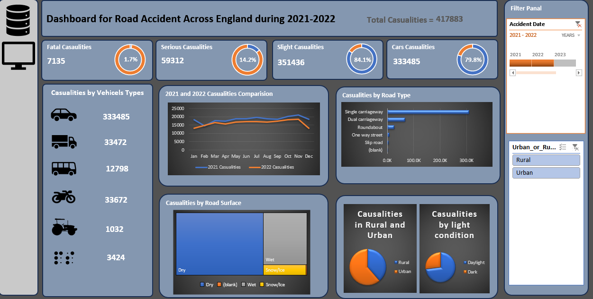

# UK-RoadAccidents-analysis
Visualization of road accidents and detail conditions in UK from 2020-2021 for priortizing safety conditions.

🧰 Tech Stack
📊 Core Tool

Microsoft Excel

⚙️ Excel Features Used

Pivot Tables – data aggregation and summarization

Pivot Charts – dynamic visualizations

Slicers & Timeline – interactive filtering (date, urban/rural)

Conditional Formatting – highlighting key metrics

Data Validation – controlled inputs and filters

🧮 Formulas & Functions

SUM / COUNT / AVERAGE – basic aggregations

IF / IFS – conditional logic

VLOOKUP / XLOOKUP – data retrieval

INDEX + MATCH – advanced lookups

TEXT / DATE functions – date formatting and grouping

🧹 Data Cleaning & Preparation

Removing duplicates

Handling missing values

Data type formatting (dates, numbers)

Structuring raw data into tabular format

📈 Dashboard & Visualization

KPI Cards (Total, Serious, Slight, Car casualties)

Line Chart (Monthly comparison 2021 vs 2022)

Bar Chart (Casualties by road type)

Pie / Donut Charts (light condition, rural vs urban)

Icon-based visual representation (vehicle types)

🧠 Analytical Techniques

Trend analysis

Comparative analysis (year-over-year)

Segmentation (vehicle type, road type, conditions)

Percentage contribution analysis

🎨 UI/UX Design in Excel

Custom layout using shapes

Icons for visual storytelling

Color theme consistency

Dashboard structuring for readability

